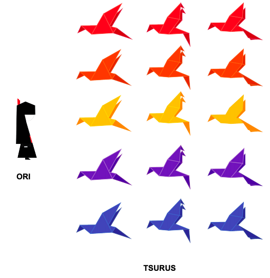
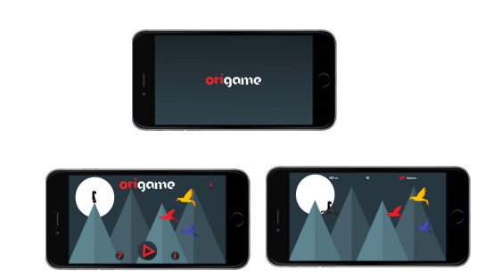

# origame

<h1 align="center">
    
</h1>

## About

\*\*\*This project was developed as a college activity.

Origame is a mobile game that aims to develop cognitive skills such as memory, attention and perception of its player.

Based on the ancient Oriental technique Origami and the life of Sadako Sasaki, Origame takes place in a world made of folds of paper where Ori,
a girl who lives in a farmers village, lives. Ori's favorite activity is to explore the mountainous surroundings of his village.

On one of his explorations, Ori realizes that his village is in danger, as a plague of paper-eating moths is coming towards him devouring everything she finds ahead,
but luckily for her a flock of Tsurus comes. fleeing the moths flying over your village towards you. For Ori to be able to reach her village in time to save her
people, she will have to jump over the Tsurus.

<h2 align="center">
  
   
  
</h2>

## Rules

- There are 15 types of Tsurus, differentiated by color and shape.
- At each jump the player must select a different Tsuru from the Tsuru
  that Ori is on.
- The differentiation rule changes with each jump, which may be due to the color or shape of the tsurus.
- The different symbol at the top of the screen shows which differentiation rule must be followed when choosing the Tsuru over which Ori will jump.
- The faster the choice of the Tsuru on which Ori will jump, the greater the number of points the player will earn.
-

## Stack

- [Lua](https://www.lua.org)
- [Corona SDK](https://coronalabs.com)
- [Corel Draw X7](https://www.coreldraw.com/br/)
